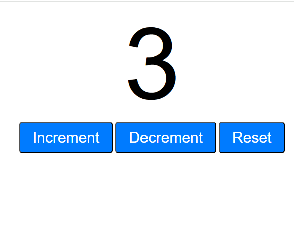

# Interactive Counter

A simple interactive counter built with HTML, CSS, and JavaScript.

## Preview



## Features

- Increment the counter by 1
- Decrement the counter by 1
- Reset the counter back to 0

## Getting Started

No installations or dependencies required.

1. Clone the repository
   ```bash
   git clone https://github.com/your-username/your-repo-name.git
   ```
2. Open `index.html` in your browser

That's it!

## Project Structure

```
├── index.html      # App structure
├── style.css       # Styling
└── script.js       # Counter logic
```

## How It Works

- The counter value is stored in a JavaScript variable
- Each button has an event listener that updates the value and re-renders it to the DOM
- The display updates instantly on every click with no page reload

## Built With

- HTML
- CSS
- JavaScript