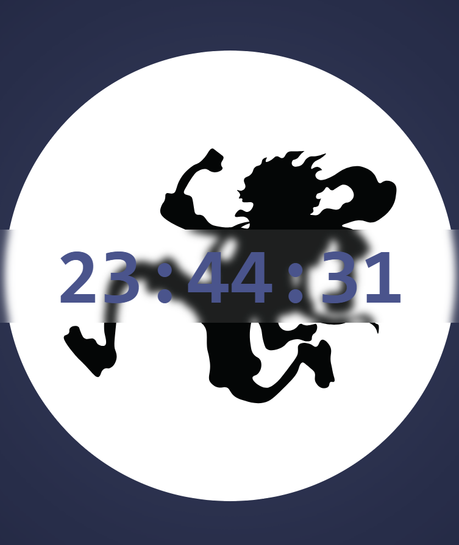

# Digital Clock Program

Simple, responsive digital clock built with HTML, CSS and JavaScript.

Overview
-
This small project displays the current local time and updates every second. It demonstrates DOM manipulation, time formatting, and responsive styling suitable for embedding in pages or learning basic JavaScript timing techniques.

Features
-
- Live time updates every second
- Supports 12/24-hour formatting (easy to add)
- Minimal, responsive layout using CSS

How it works
-
The script reads the current time with the JavaScript `Date` object, formats hours/minutes/seconds, and updates a DOM element on an interval (using `setInterval`).

Usage
-
1. Open `index.html` in a browser.
2. The clock starts automatically and updates each second.

Customization
-
- Change time format (12/24) by adjusting the formatting logic in `index.js`.
- Style the clock in `style.css` to match your site.

File structure
-
- `index.html` — markup for the clock
- `index.js` — script that updates the time
- `style.css` — visual styles for the clock

Contributing
-
PRs welcome. Open an issue if you'd like features such as timezone selection, alarms, or animations.

License
-
This project is provided as-is for learning and demo purposes.